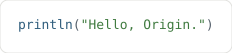
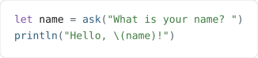
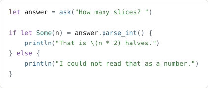
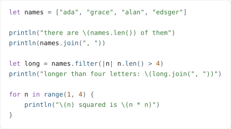
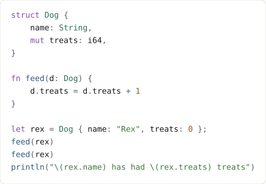
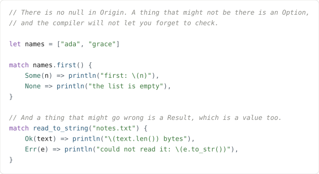

# Origin

A statically typed, garbage-collected language and its complete toolchain, built from
nothing until the compiler compiles itself — no LLVM, no Cranelift, no libc, no linker.
The compiler emits x86-64 machine code bytes directly and writes its own ELF and Mach-O
executables.

**[Try it in your browser →](https://origin-language.vercel.app)** ·
**[Learn it in nine steps →](https://origin-language.vercel.app/tutorial.html)**

Nothing is uploaded. The playground is the whole compiler and both engines, compiled to
WebAssembly and run in your tab.

---

## The language

This is a complete program. There is no `main` to write and nothing to import.



It reads what you type, a line at a time:



An answer is text, so turning it into a number is something that might not work — and
Origin will not let you forget to ask:



Lists, and the things you do to them:



Your own types, where a field you can change says so:



There is no `null` and there are no exceptions. A value that might be missing is an
`Option`; one that might have failed is a `Result`; both are ordinary values you take apart
with `match`:



## What holds

These are load-bearing across the whole compiler, not style preferences:

| | |
|---|---|
| **No undefined behaviour** | every operation produces a defined value or traps |
| **Optimization is unobservable** | identical stdout and exit status at `-O0`, `-O1` and `-O2` |
| **No null** | `Option[T]`, no zero values, no uninitialized bindings |
| **Errors are values** | `Result` and `?`; no exceptions and no unwinding |
| **Immutable by default** | `mut` on a binding to reassign it, `mut` on a field to change it |
| **Integer overflow traps** | at every optimization level, with the source span |
| **Generics are monomorphized** | the backend never sees a type variable |
| **No data races in safe Origin** | `Send` is derived structurally by the checker |

## What is here

```
originc         the compiler: an interpreter, a bytecode VM, and a native x86-64 backend
stage1/src      the same compiler, written in Origin -- 45 modules, 34,700 lines
bootstrap/      the last known-good stage1 binary, which reproduces itself byte for byte
internal/gc     a precise generational moving collector
internal/x86    a hand-written instruction encoder
internal/obj    ELF and Mach-O writers; there is no linker
web/            the playground and the tutorial: a static page with no backend at all
docs/spec/      the normative specification, sections 00 through 18
docs/adr/       forty-three architecture decision records, and why each alternative lost
```

### The compiler compiles itself

```
originc build -O1 stage1/src        -> 4,619,739 bytes
that binary, over the same source   -> the same bytes
and again                           -> the same bytes
```

Every component is held to the Go one it replaces, over this repository's own ~465
`.origin` files: the token stream, the syntax tree, the places errors are reported, name
resolution, type inference, the instantiation set, the bytecode, the SSA at three
optimization levels, the encoded instructions, the executables — and, above all of them,
the executable itself.

## Building and running

Go 1.24 or later. There are no other dependencies.

```bash
./check                                   # gofmt, vet, build, and the whole test suite
go run ./cmd/originc run   hello.origin   # run it
go run ./cmd/originc run --vm hello.origin
go run ./cmd/originc build hello.origin   # a native executable, with no linker
go run ./cmd/originc check hello.origin   # diagnostics only
./build-web                               # the playground's WebAssembly module
```

`./check` is the gate: it must exit 0 before any commit. It enforces a five-minute ceiling
on the suite and a 3 GB ceiling on peak memory, and fails the run when either is breached.

## Reading the source

Start with [`CLAUDE.md`](CLAUDE.md) — the process rules, the layout, and what each phase
built. Then:

- [`docs/spec/`](docs/spec) is normative. [`10-examples.md`](docs/spec/10-examples.md) is
  every worked example with its exact output; each one is a file in
  [`tests/e2e/cases/`](tests/e2e/cases) that the suite runs on three engines at three
  optimization levels.
- [`docs/adr/`](docs/adr) records every irreversible choice and why the alternatives were
  rejected.
- [`docs/phases/`](docs/phases) is what each phase built, what it deferred, and what
  surprised it.
- [`docs/deferred.md`](docs/deferred.md) is everything deliberately left out, each item
  with the reason and a phase.
